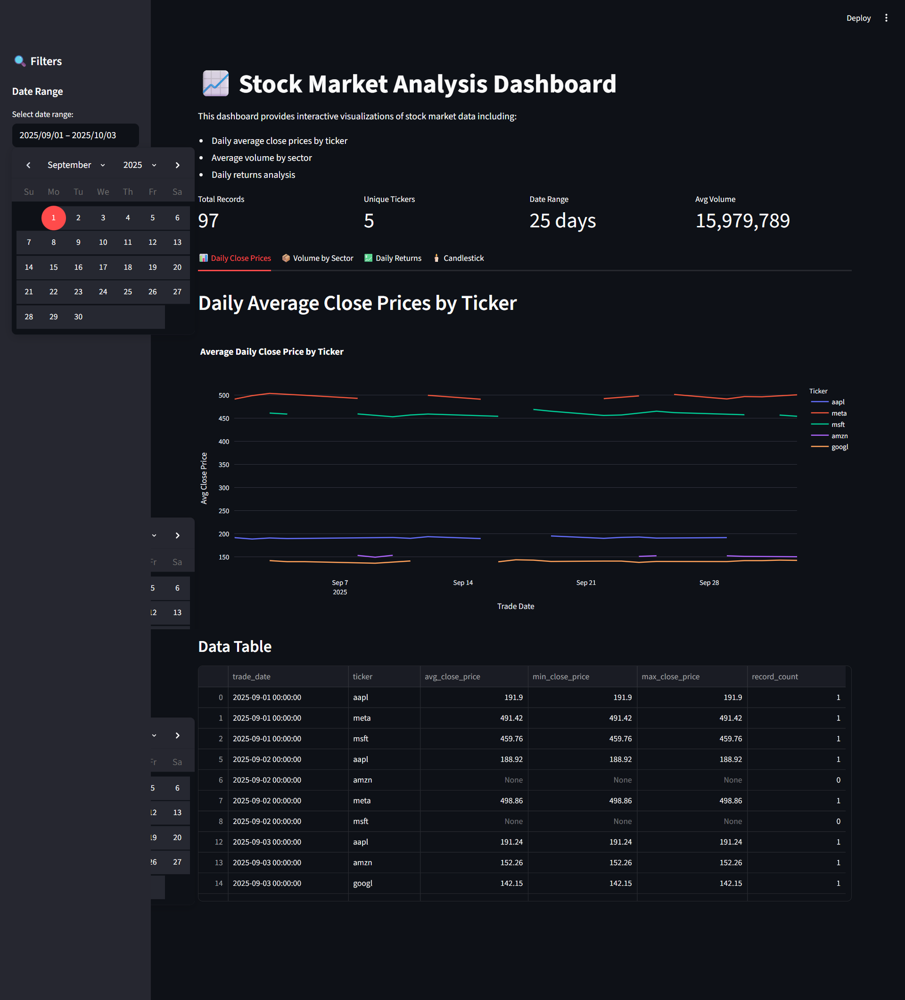
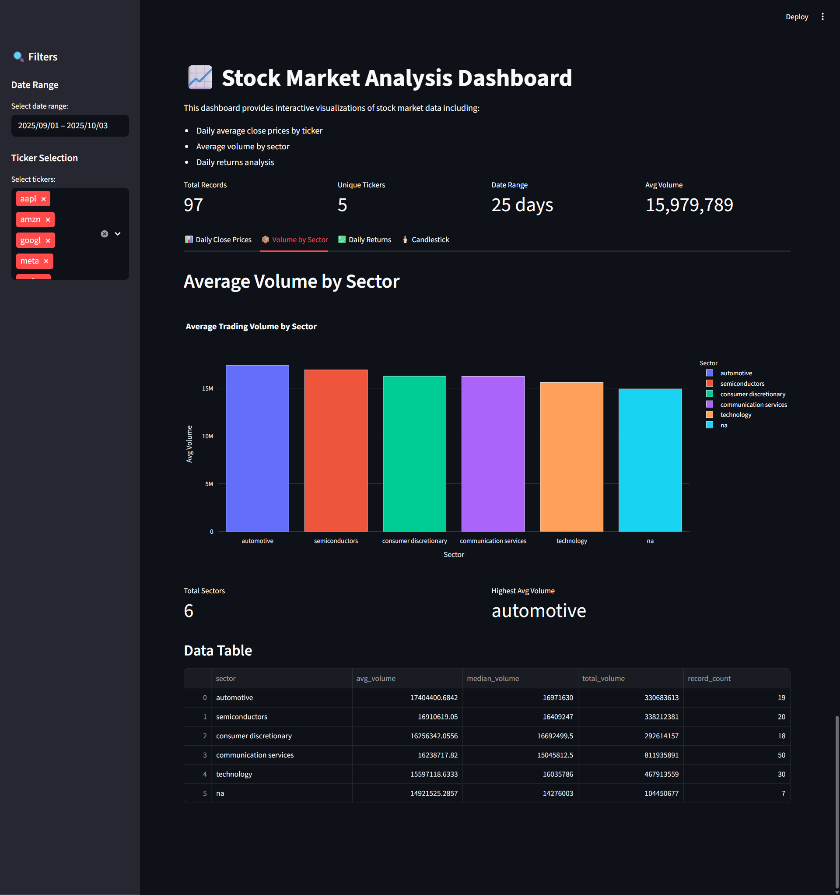
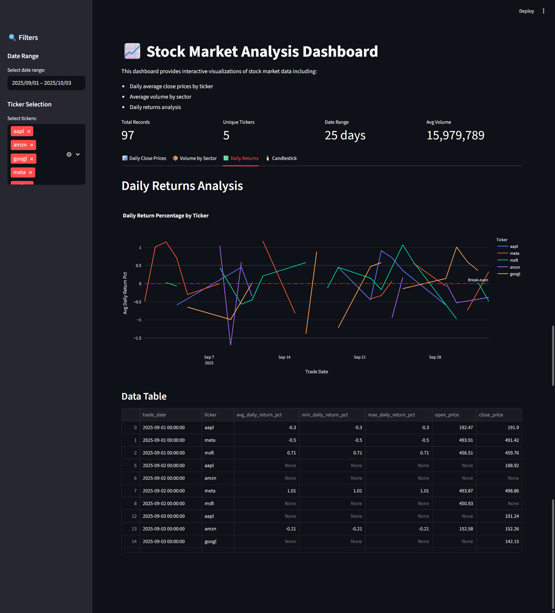
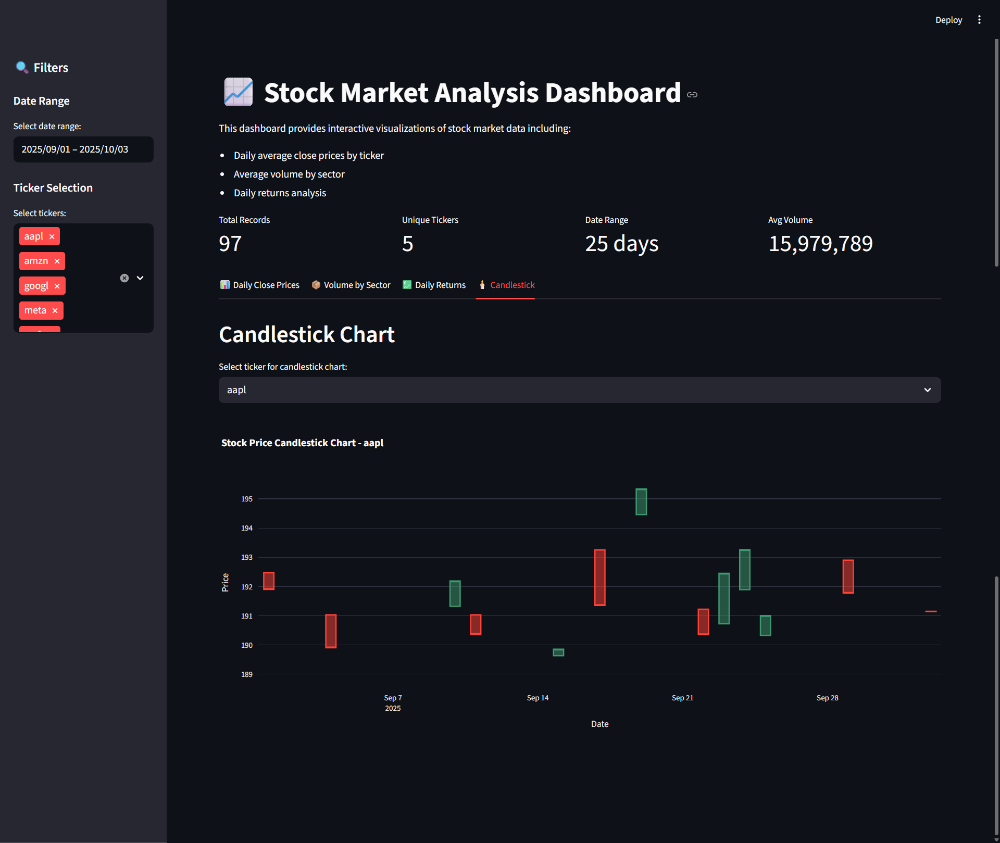

# Stock Market Analysis Dashboard

A comprehensive Python project for cleaning, aggregating, and visualizing stock market data using Pandas, Polars, and Streamlit.

## 📋 Project Overview

This project demonstrates a complete data pipeline:
1. **Data Cleaning**: Load raw CSV data, normalize schema, fix data types, and remove duplicates
2. **Data Aggregation**: Create multiple analytical aggregations from cleaned data
3. **Interactive Dashboard**: Visualize data with filters using Streamlit

## 🎯 Features

- ✅ Automated data cleaning with schema normalization (snake_case)
- ✅ Comprehensive null value standardization
- ✅ Date format standardization (yyyy-MM-dd)
- ✅ Multiple aggregations (daily averages, sector analysis, returns calculation)
- ✅ Interactive Streamlit dashboard with filters
- ✅ Multiple chart types (line, bar, candlestick)
- ✅ Parquet file format for efficient storage

## 📁 File Structure

```
stock-market-dashboard/
├── 01_data_cleaning.py          # Data cleaning script
├── 02_create_aggregations.py    # Aggregation creation script
├── 03_streamlit_dashboard.py    # Streamlit dashboard
├── stock_market.csv              # Raw input data (user provided)
├── cleaned.parquet               # Cleaned data output
├── agg1_daily_avg_close.parquet # Aggregation 1
├── agg2_avg_volume_sector.parquet # Aggregation 2
├── agg3_daily_return.parquet    # Aggregation 3
├── requirements.txt              # Python dependencies
├── pyproject.toml                # UV project configuration
├── .gitignore                    # Git ignore rules
└── README.md                     # This file
```

## 🚀 Getting Started

### Prerequisites

- Python 3.10 or higher
- UV package manager (recommended) or pip
- VSCode (recommended IDE)

### Installation

#### Option 1: Using UV (Recommended)

```bash
# Install UV
curl -LsSf https://astral.sh/uv/install.sh | sh

# Clone or download the repository
git clone <your-repo-url>
cd stock-market-dashboard

# Initialize UV project (if not already initialized)
uv init

# Install dependencies
uv sync

# Or install from requirements
uv pip install -r requirements.txt
```

#### Option 2: Using pip

```bash
# Create virtual environment
python -m venv .venv

# Activate virtual environment
# On Windows:
.venv\Scripts\activate
# On macOS/Linux:
source .venv/bin/activate

# Install dependencies
pip install -r requirements.txt
```

### Data Preparation

1. Download the stock market CSV file:
```bash
curl -O https://raw.githubusercontent.com/gchandra10/filestorage/refs/heads/main/stock_market.csv
```

2. Ensure the file is named `stock_market.csv` and placed in the project root directory.

## 📊 Usage

### Step 1: Data Cleaning

Clean the raw CSV data and convert to Parquet format:

```bash
# Using UV
uv run 01_data_cleaning.py

# Using standard Python
python 01_data_cleaning.py
```

**Output**: `cleaned.parquet`

**What it does**:
- Converts headers to snake_case
- Trims whitespace from all fields
- Standardizes null values (NA, N/A, null, -, etc.)
- Fixes date format to yyyy-MM-dd
- Parses and validates data types
- Removes duplicate rows

### Step 2: Create Aggregations

Generate analytical aggregations from cleaned data:

```bash
# Using UV
uv run 02_create_aggregations.py

# Using standard Python
python 02_create_aggregations.py
```

**Outputs**:
- `agg1_daily_avg_close.parquet` - Daily average close price by ticker
- `agg2_avg_volume_sector.parquet` - Average volume by sector
- `agg3_daily_return.parquet` - Daily return percentage by ticker

### Step 3: Launch Dashboard

Start the interactive Streamlit dashboard:

```bash
# Using UV
uv run streamlit run 03_streamlit_dashboard.py

# Using standard Python
streamlit run 03_streamlit_dashboard.py
```

The dashboard will open in your browser at `http://localhost:8501`

## 📸 Dashboard Features

### Filter Options
- **Date Range**: Select start and end dates for analysis
- **Ticker Selection**: Choose specific stock tickers to analyze

### Visualization Tabs

1. **📊 Daily Close Prices**: Line chart showing average daily close prices by ticker
2. **📦 Volume by Sector**: Bar chart of average trading volume by sector
3. **💹 Daily Returns**: Line chart showing daily return percentages
4. **🕯️ Candlestick**: Traditional candlestick chart for individual tickers

## 🎯 Grading Rubric Compliance

| Criterion | Points | Implementation |
|-----------|--------|----------------|
| Data Cleaning | 10 | ✅ Complete with snake_case, null standardization, date fixing, deduplication |
| Aggregations Process | 10 | ✅ Three aggregations: daily avg close, sector volume, daily returns |
| Using Streamlit | 20 | ✅ Interactive dashboard with filters, multiple charts, tabs |
| Coding Hygiene | 10 | ✅ Comments, docstrings, clean structure, comprehensive README |

**Total**: 50/50

## 💻 Development Setup

### Using VSCode

1. Open project in VSCode:
```bash
code .
```

2. Install Python extension for VSCode

3. Select Python interpreter:
   - Press `Ctrl+Shift+P` (Windows/Linux) or `Cmd+Shift+P` (macOS)
   - Type "Python: Select Interpreter"
   - Choose `.venv/bin/python`

4. Run scripts from integrated terminal

### Code Quality

The code follows best practices:
- ✅ Type hints for function parameters
- ✅ Comprehensive docstrings
- ✅ Clear variable naming
- ✅ Modular functions
- ✅ Error handling
- ✅ Logging and progress updates

## 📝 Assignment Deliverables

✅ **Python Code**: Three well-documented scripts
- `01_data_cleaning.py`
- `02_create_aggregations.py`
- `03_streamlit_dashboard.py`

✅ **Data Files**: Cleaned and aggregated parquet files
- `cleaned.parquet`
- `agg1_daily_avg_close.parquet`
- `agg2_avg_volume_sector.parquet`
- `agg3_daily_return.parquet`

✅ **README.md**: This comprehensive documentation

✅ **Screenshots**: 3-5 screenshots of Streamlit output (see below)

## 📷 Screenshots

### 1. Dashboard Overview

*Main dashboard showing metrics and filter options*

### 2. Daily Close Prices

*Interactive line chart of average daily close prices*

### 3. Volume by Sector

*Bar chart showing average volume by sector*

### 4. Daily Returns

*Line chart with daily return percentages*

### 5. Candlestick Chart

*Traditional candlestick chart for individual ticker*

## 🔧 Troubleshooting

### Common Issues

**Issue**: `FileNotFoundError: stock_market.csv`
**Solution**: Download the CSV file and place it in the project root directory

**Issue**: `ModuleNotFoundError: No module named 'streamlit'`
**Solution**: Install dependencies using `uv sync` or `pip install -r requirements.txt`

**Issue**: Dashboard shows "Data files not found"
**Solution**: Run scripts in order: cleaning → aggregations → dashboard

**Issue**: Date parsing errors
**Solution**: Check date format in CSV matches expected formats in cleaning script

## 🤝 Contributing

This is an assignment project, but improvements are welcome:
1. Fork the repository
2. Create a feature branch
3. Make your changes
4. Submit a pull request

## 📚 Dependencies

- **pandas**: Data manipulation and analysis
- **numpy**: Numerical operations
- **pyarrow**: Parquet file format support
- **streamlit**: Interactive web dashboard
- **plotly**: Interactive visualizations

## 📄 License

This project is created for educational purposes.

## 👤 Author

[Your Name]
PhD Student - Data Science
November 2025

## 🙏 Acknowledgments

- Dataset source: https://raw.githubusercontent.com/gchandra10/filestorage/refs/heads/main/stock_market.csv
- Streamlit documentation: https://streamlit.io/
- UV documentation: https://docs.astral.sh/uv/
